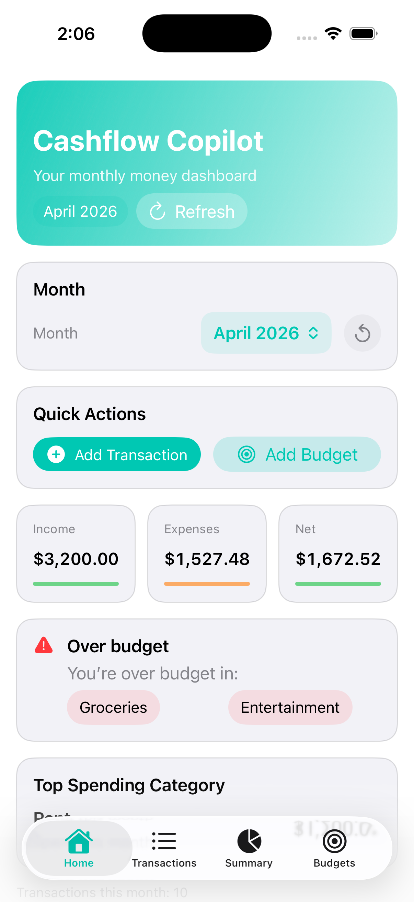
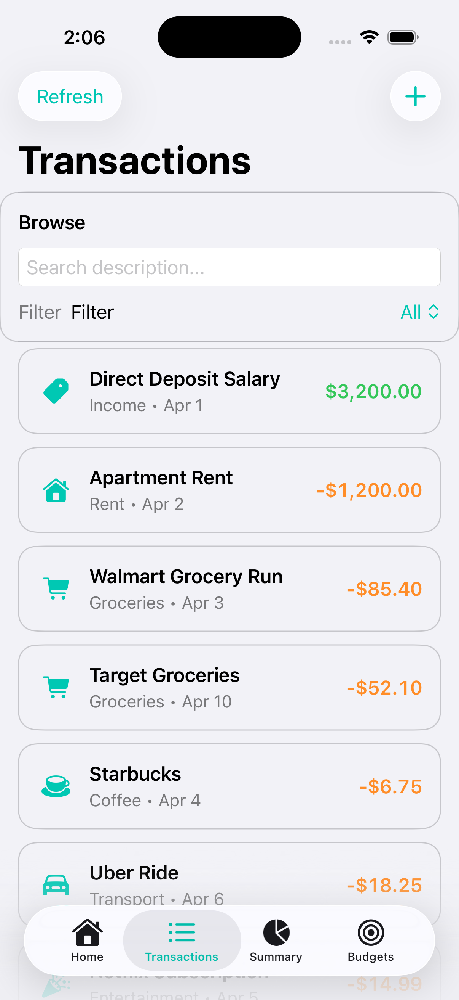
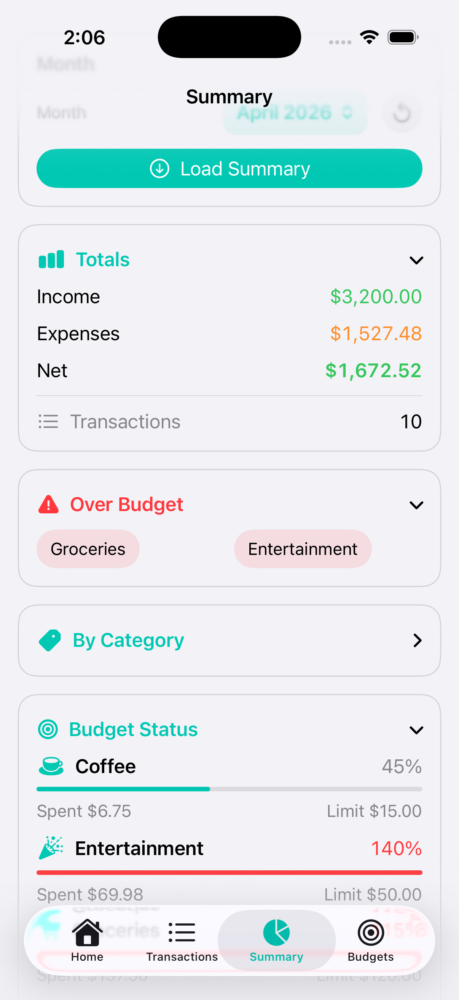
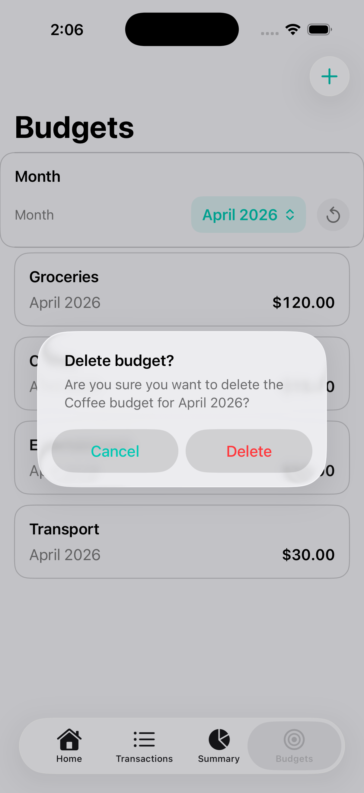

# 💰 Cashflow Copilot

Cashflow Copilot is a full-stack personal finance application that helps users track transactions, manage budgets, and visualize monthly financial data through a clean and intuitive mobile interface.

This project was built to simulate a real-world budgeting app, focusing on both backend functionality and frontend user experience.

---

## 🤖 AI-Assisted Development

The SwiftUI frontend was developed with assistance from AI tools such as ChatGPT. These tools were used to:

- accelerate UI development and layout design  
- troubleshoot SwiftUI-specific issues  
- explore best practices for state management and API integration  

All code was reviewed, tested, and integrated manually to ensure correctness and understanding.

---

## 🚀 Features

### 📊 Dashboard (Home)
- Monthly overview of income, expenses, and net balance
- Quick insights into financial health
- Over-budget alerts for categories

### 💳 Transactions
- Add, edit, and delete transactions
- Search transactions by description or category
- Filter by income or expenses
- Swipe actions for quick interaction

### 🎯 Budgets
- Create budgets by category and month
- Edit and delete budgets
- Track spending against budget limits
- Over-budget detection

### 📈 Summary
- Breakdown of income vs expenses
- Category-based spending insights
- Budget utilization percentages

---

## 🛠 Tech Stack

### Frontend
- SwiftUI (iOS)
- Xcode + iOS Simulator
- State-driven UI with async networking

### Backend
- FastAPI (Python)
- SQLAlchemy ORM
- SQLite database

### Tools
- Git & GitHub (branching + pull requests)
- VS Code
- pytest (backend testing)

---

## 🧱 Architecture

The project is structured into separate layers:

- `backend/` → API, database, business logic  
- `frontend/` → SwiftUI mobile app  
- `docs/` → documentation + screenshots  

The frontend communicates with the backend through REST APIs.  
The backend handles validation, logic, and data persistence, while the frontend manages UI state and user interactions.

---

## 📸 Screenshots

| Home Dashboard | Transactions |
|----------------|--------------|
|  |  |

| Summary | Budgets |
|---------|---------|
|  |  |

---

## ▶️ How to Run

### Backend

cd backend  
uvicorn main:app --reload  

Then open:  
http://127.0.0.1:8000/docs  

---

### Frontend

1. Open:  
frontend/CashflowCopilot.xcodeproj  

2. Select an iPhone simulator (e.g., iPhone 17 Pro)

3. Run the app

---

## 🧠 Key Learnings

- Built a full CRUD API using FastAPI  
- Designed a modular backend with clear separation of concerns  
- Integrated a SwiftUI frontend with live API data  
- Implemented real-world UX patterns (swipe actions, confirmations, responsive UI)  
- Managed asynchronous data flow between frontend and backend  

---

## 👨‍💻 Author

Stephen Herrera  
Computer Science Student